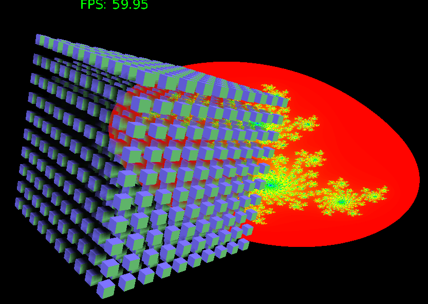
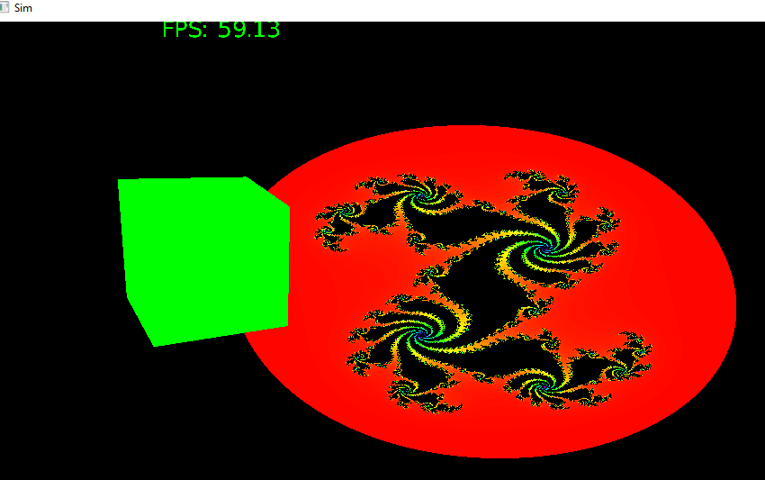

# go-sim
Experimental simulator software

# Devlog
## C# Switch
### 10-31
Exploratory terrain rendering

### 9-12
Switching to C# with OGRE3D

## Go with CUDA tests
### 9-8
Pulling in shading logic (some work still needed)

### 9-8
Pulling in basic model rendering code.

### 8-26
Fractal rendering with OpenGl.

