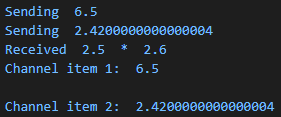

# Tour of Go
<!-- Intro. This is a broader tour, not really a 'learn Go' tour. -->
*Gustave Granroth 8/2021*

---

# Resources
<!-- This is also a 'Go from my perspective' tour. -->
## Public
- Download: https://golang.org/dl/
- Official Tour: https://tour.golang.org/welcome/1

---

## Why Go? <!-- From my opinion -->
- Small core language, easy to learn <!-- C vs C++ -->
- Modern language features (garbage collection, concurrency mechanisms, duck typing, multiple returns)
- Modern ecosystem features (auto formatting, [versioned](https://semver.org/) source-based package repositories, VSCode integration)
- Quick compile times

## Why Not Go? <!-- Some of the options above -->
- Sometimes too small and low-level. Minimal OO support, format strings are trickier than C#/Python, missing generics. Pointers are simpler, but present. 
- Less frequent updates, by design

---

# Sample
<!-- Notably, this code is auto-formatted for you upon save in VSCode.
This is also 'C-like', without ';', but with '() {' enforced.
-->
**go.mod**
```yaml
module helium24.net/fractal

go 1.16
```
**test.go**
```go
package main

import "fmt"

func main() {
    fmt.Println("Hello, World!")
}
```
<!-- or F5 in VSCode -->
```bash
$ go build . # Compile
$ go run . # Compile and run
```
---

### Sample, but better
<!-- Interesting notes: 
- Types are reversed
- Multiple returns supported
- := for assignment, no type needed there
-->
```go
package main

import (
    "fmt"
    "math"
)

type Vertex struct {
    X int
    Y int
}

func vectorLength(v Vertex) (float64, int) {
    return math.Sqrt(float64(v.X*v.X + v.Y*v.Y)), 1
}

func main() {
    a := Vertex{1, 2}
    result, aNumber := vectorLength(a)

    fmt.Println("Length: ", result, " ", aNumber)
}
```
```bash
Length:  2.23606797749979   1
```

---
# Sample, but with data structures

---
# Sample, but with multiple files
<!-- It's not 'C with classes', but 'Modern C' like. No headers needed. -->
Files in the same package (aka folder) can reference methods directly in other files
### main.go
```go
package main

func main() {
    printHello()
}
```

### other.go
```go
package main

import "fmt"

func printHello() {
    fmt.Println("Hello World!")
}
```

---
# Sample, but with multiple files, continued
<!-- Golang has a surprisingly simple way for public/private modularization.
Absolute paths is a bit annoying though with larger projects.-->
References between packages requires **absolute** imports
**main.go**
```go
package main
import "myRepository/textOutput"

func main() {
    textOutput.PrintHello()
    // Only variables/functions with aa capital letter are visible externally
}
```
**textOutput/print.go**
```go
package textOutput
import "fmt"

func PrintHello() {
    fmt.Println("Hello World!")
}
```


---
# Notable Features
---

## Feature: Concurrency

<!-- About
'go' creates a new goroutine. It's not a dedicated thread and is cheap to spin up. It may or may not run in parallel.
'defer' is effectively a C# 'finally', but for a method.
'chan' is a goroutine/thread-safe data transfer mechanism
It creates a channel data can be put into and read from
-->
```go
package main

import (
	"fmt"
	"time"
)

func multiplyAndSend(left, right float64, dst chan float64) {
	defer fmt.Println("Received ", left, " * ", right)
	result := left * right

	fmt.Println("Sending ", result)
	dst <- result
}

func main() {
	channel := make(chan float64)
	go multiplyAndSend(1.1, 2.2, channel)
	go multiplyAndSend(2.5, 2.6, channel)
	
	fmt.Println("Channel item 1: ", <-channel)
	fmt.Println()
	fmt.Println("Channel item 2: ", <-channel)
}
```
---

## Feature: Duck Typing
Types implement interfaces by having all the methods defined for that interface.  
```go
type Sizeable interface { // ISizaeable
    MinLength() float64
    LengthSquared() float64
}

type IntVertex struct {
    X int
    Y int
}

func (v *IntVertex) MinLength() int {
...
}

func (v *IntVertex) LengthSquared() int {
...
}

...
var vectorValue Sizeable // Implicit pointer type
vectorValue := IntVertex{1, 2}
```
---


